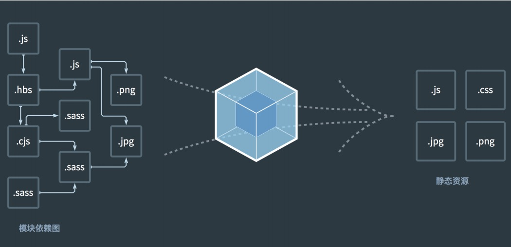
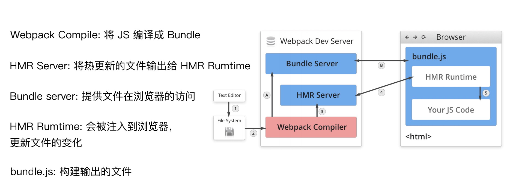
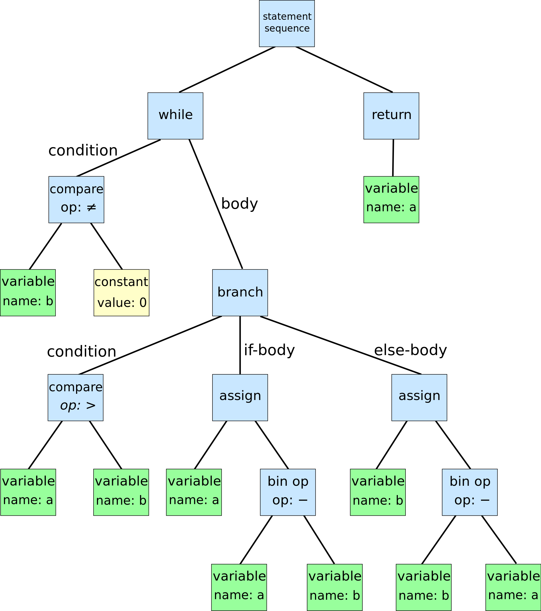
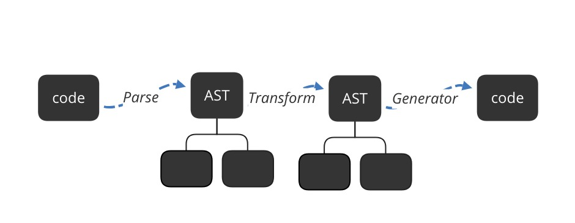

## 认识前端工具链（二）

### 前端工具链综述

工具链在前端领域扮演着很重要的角色。如何**为Javascript生产环境构建去构建一套工具链，来覆盖前端各个开发环节**，是我们需要了解学习的。而一套高效的工具链体系，对于每一个前端团队来说都有着至关重要的意义，它不仅可以提高团队的开发效率，还可以在一定程度上规范前端开发的各个环节，进而为团队节省一些人员协作和调整的成本。

综上，**前端工具链旨在友好开发体验，提升开发团队开发效率**。

而要构建一个工具链，首先我们先要了解在前端开发领域有哪几个环节：

* 项目初始化
* 开发、调试、构建
* 单元测试
* 发布

所以一个前端工具链，它大致都会包含上面这一系列功能。而一个典型的示例就类似于下面：

* Yeoman
* Webpack
* Mocha
* 发布系统

我们可以将进而将它总结成下面几块：

* 脚手架
* **构建⼯具**
* 测试工具
* 发布系统

而上了规模的团队也都会针对以上的流程，制定一个工具链，并将它包装成一个黑盒形式，让程序员在每个环节只需要运行简单命令行，即可进入开发流程。

而从整体上了解工具链相关的知识体系，熟悉其大致结构以及运作方式，也是十分重要的。

所以，下面这里是本人将对于工具链相关基础知识的一些整理。这一篇我们首先来介绍的是，工具链中的**构建工具**。

### 构建工具

对于一个工具链来说，经过一系列的初始化操作，接下了最重要的工作就是build它。build的能力是一种独立的能力，它是同时为开发以及发布服务基础设施。

同时由于我们浏览器在某些方面是天然友好，同时考虑到方便开发、性能优化，所以为了解决像：```转换ES6语法```、```JSX转换```、```CSS 前缀补全/预处理器```、```压缩混淆```、```图⽚压缩```等问题，我们需要使用构建⼯具。

这里我们接下来介绍的使我们的**webpack**以及我们常用到的**babel**。

首先各种构建工具的对比：

| 名称         | webpack        | grunt       | gulp        |
| ------------ | -------------- | ----------- | ----------- |
| 定义         | Module bundler | Task runner | Task runner |
| 语言         | JavaScript     | Node.js     | Node.js     |
| 发布时间     | 2012.3         | 2012.6      | 2013.7      |
| GitHub stars | 58.3k          | 12.1k       | 32.2k       |
| 周下载量     | 13,373,858     | 670,553     | 1,215,605   |

##### 为什么选择webpack？

构建工具是按照它们诞生的时间排序的，它们是时代的产物，侧面反映出Web开发的发展趋势，如下所述：

* 在Grunt时代，Web开发要做的事情变多，流程复杂，自动化思想被引入，用于简化流程；

* 在Gulp时代，开始出现一些新语言用于提高开发效率，流式处理思想的出现是为了简化文件转换的流程，例如将ES5转换成ES6；

* 在Webpack时代，由于单页应用的流行，网页的功能和实现代码变得复杂、庞大，Web开发向模块化改进。

这些构建工具都有各自的定位和专注点，它们之间既可以单独完成任务，也可以相互搭配来弥补各自的不足。在了解这些常见的构建工具后，我们需要根据自己的需求去判断应该如何选择和搭配它们才能更好地满足自己的需求。

经过多年的发展，Webpack已经成为构建工具中的首选，这是有原因的：

* **配置灵活和插件化扩展：**大多数团队在开发新项目时会采用紧跟时代的技术，这些技术几乎都会采用“模块化+新语言+新框架”，Webpack可以为这些新项目提供一站式的解决方案；

* **官⽅更新迭代速度快**：Webpack有良好的生态链和维护团队，能提供良好的开发体验并保证质量；

* **社区⽣态丰富：**Webpack被全世界大量的Web开发者使用和验证，能找到各个层面所需的教程和经验分享。

#### webpack

Webpack是一种常见的build工具，它最初是为**Node**设计的一款打包工具，它可将一个**Node**的代码打包成一个浏览器可用的代码，所以它从最初的设计上是一个完全针对于JS的这样的一个系统，并没有涉及到html的部分，以至于现在有许多的后起之秀的打包工具是基于html去打包的，相比之下对于配置的要求就要低得多。

Webpack的核心思路就是将所有相关的代码，经过一系列build操作之后，打包成一个js文件，并需要我们手工的引用js文件到html。

Webpack可以帮助我们做多文件合并，在合并的过程中它可以通过各种各样的**loader和plugin**去控制合并的一些规则，并进而对文本进行一些转换。




#### webapck的核心概念

##### Entry

Entry是wepack从哪个文件开始进行构建打包。

```js
// 单入口entry是一个字符串
moudule.exports = {
  entry: './src/index.js'
}
// 多入口entry是一个对象
moudule.exports = {
  entry: {
    app: './src/app.js'
    home: './src/home.js'
  }
}
```

##### Output

Output ⽤来告诉 webpack 如何将编译后的⽂件输出到磁盘。

```js
// Output 的⽤法：单⼊⼝配置
module.exports = {
  entry: './src/index.js'
  output: {
  filename: 'bundle.js’,
  path: __dirname + '/dist'
  }
};
// Output 的⽤法：多⼊⼝配置
module.exports = {
  entry: {
    app: './src/app.js',
    home: './src/home.js'
  },
  output: {
    filename: '[name].js',// 通过占位符确保⽂件名称的唯⼀
    path: __dirname + '/dist'
  }
};
```

##### Loaders

**webpack** 开箱即用只支持 JS 和 JSON 两种文件类型，通过 **Loaders** 去支持其它文件类型并且把它们转化成有效的模块，并且可以添加到依赖图中。**Loaders**本身是一个函数，接受源文件作为参数，返回转换的结果。

Loaders 的⽤法:

```js
const path = require('path');
module.exports = {
  output: {
    filename: 'bundle.js'
  },
	module: {
    rules: [
        { test: /\.txt$/, use: 'raw-loader' }// test 指定匹配规则, use 指定使⽤的 loader 名称 
    ]
  }
};
```

常用Loaders：

| 名称          | 描述                                                       |
| ------------- | ---------------------------------------------------------- |
| babel-loader  | 转换ES6、ES7等JS新特性语法                                 |
| css-loader    | 支持.css文件加载和解析                                     |
| ts-loader     | 将TS转换成JS                                               |
| file-loader   | 进行图片、字体等的打包                                     |
| thread-loader | 多进程打包JS和CSS                                          |
| html-loader   | 将 HTML 导出为字符串。当编译器需要时，将压缩 HTML 字符串。 |
| less-loader   | webpack 将 Less 编译为 CSS 的 loader                       |

具体可参见：[loaders](https://webpack.docschina.org/loaders/)

##### Plugins

插件⽤于 **bundle** ⽂件的优化，资源管理和环境变量注⼊，作⽤于整个构建过程。

```js
const path = require('path');
module.exports = {
  output: {
  	filename: 'bundle.js'	
  },
  plugins: [
    new HtmlWebpackPlugin({template: 
      './src/index.html'})
  ]
};
```

常用Plugins：

| 名称                       | 描述                                                         |
| -------------------------- | ------------------------------------------------------------ |
| CommonsChunkPlugin         | CommonsChunkPlugin是一项选择加入功能，可创建一个单独的文件（称为块），该文件由多个入口点之间共享的通用模块组成。 |
| UglifyjsWebpackPlugin      | 此插件使用 [uglify-js](https://github.com/mishoo/UglifyJS2) 压缩你的 JavaScript。 |
| ExtractTextWebpackPlugin   | 从一个或多个包中提取文本到一个单独的文件中。                 |
| HtmlWebpackPlugin          | 创建html文件去承载输出的bundle                               |
| HotModuleReplacementPlugin | 启用热模块更换（HMR）                                        |
| CopyWebpackPlugin          | 将单个文件或整个目录（已存在）复制到构建目录。               |
| EslintWebpackPlugin        | 用于Webpack的ESLint插件                                      |

具体可参见：[Plugins](https://webpack.docschina.org/plugins/)

##### Mode

**Mode** ⽤来指定当前的构建环境是：**production**、**development** 还是 **none**；设置 **mode** 可以使⽤ **webpack** 内置的函数，默认值为 **production**。

| 选项          | 描述                                                         |
| :------------ | :----------------------------------------------------------- |
| `development` | 会将 `DefinePlugin` 中 `process.env.NODE_ENV` 的值设置为 `development`. 为模块和 chunk 启用有效的名。 |
| `production`  | 会将 `DefinePlugin` 中 `process.env.NODE_ENV` 的值设置为 `production`。为模块和 chunk 启用确定性的混淆名称，`FlagDependencyUsagePlugin`，`FlagIncludedChunksPlugin`，`ModuleConcatenationPlugin`，`NoEmitOnErrorsPlugin` 和 `TerserPlugin` 。 |
| `none`        | 不使用任何默认优化选项                                       |

具体可参见：[Mode](https://webpack.docschina.org/configuration/mode/)

#### 高频面试题

[**模块热替换(hot module replacement)**](https://webpack.docschina.org/concepts/hot-module-replacement/)

模块热替换(HMR - hot module replacement)功能会在应用程序运行过程中，替换、添加或删除 [模块](https://webpack.docschina.org/concepts/modules/)，而无需重新加载整个页面。主要是通过以下几种方式，来显著加快开发速度：

- 保留在完全重新加载页面期间丢失的应用程序状态。
- 只更新变更内容，以节省宝贵的开发时间。
- 在源代码中 CSS/JS 产生修改时，会立刻在浏览器中进行更新，这几乎相当于在浏览器 devtools 直接更改样式。

热更新分为两个过程：



- 第一个过程是启动阶段：

- - 文件系统对文件进行一个编译，将初始的代码都经过webpack Complie进行一个打包，打包好了之后，将编译好的这个文件传输给Bundle Server。Bundle Server是一个服务器，Bundle Server 以server的方式让浏览器可以访问到打包好的Bundle.js文件，
  - 这个是一个启动的阶段，对照图中的1->2->A->B。

- 第二个过程是文件更新阶段：

- - 在本地开发的过程中，有文件发生了变化。同样，变化的文件会经过文件系统的编译，webpack Complie进行一个打包。
  - 然后，他会将编译之后的代码发送给HMR Server，HMR Server就可以知道哪些资源、模块发生了改变。即源代码js里面哪些模块发生了改变。
  - 然后，HMR Server（服务端）会通过web socket的形式通知HMR Runtime（客户端浏览器）那些文件代码发生了变化，通常以JSON的树进行传输，HMR Runtime接收到了之后就会进而去更新我们的代码，最后进过一系列的自动操作自动更新到浏览器页面上。
  - 这个是一个更新的阶段，对照图中的1->2->3->4。

#### babel

Babel是一个JS的转义器，用于 es next、typescript等代码的转换，同时还暴露出了 api 让开发者可以进行特定用途的转换，另外还可用于做各种静态分析。

##### 安装使用

运行以下命令安装所需的包（package）：

```shell
npm install --save-dev @babel/core @babel/cli @babel/preset-env
npm install --save @babel/polyfill
```

在项目的根目录下创建一个命名为 `babel.config.json` 的配置文件（需要 `v7.8.0` 或更高版本），并将以下内容复制到此文件中：

```json
{
  "presets": [
    [
      "@babel/env",
      {
        "targets": {
          "edge": "17",
          "firefox": "60",
          "chrome": "67",
          "safari": "11.1",
        },
        "useBuiltIns": "usage",
        "corejs": "3.6.5",
      }
    ]
  ]
}
```

* @babel/preset-env : babel配置繁琐，这里存储了一些常用的babel配置

运行此命令将 `src` 目录下的所有代码编译到 `lib` 目录：

```shell
./node_modules/.bin/babel src --out-dir lib
```

这就是babel独立使用的一些操作，但是实际上我们并不会独立使用它，而是使用```babel-loader```,将babel工具用于Webpack打包的过程中，对每个文件都执行babel操作。

了解了babel的简单使用，接下来就要讲到babel的工作原理了。

在介绍babel的工作原理之前我们先要了解一个概念：**AST**， 即**抽象语法树**（**A**bstract **S**yntax **T**ree，AST）。

**什么是AST？**

在[计算机科学](https://zh.wikipedia.org/wiki/计算机科学)中，**抽象语法树**（**A**bstract **S**yntax **T**ree，AST），或简称**语法树**（Syntax tree），是[源代码](https://zh.wikipedia.org/wiki/源代码)[语法](https://zh.wikipedia.org/wiki/语法学)结构的一种抽象表示。它以[树状](https://zh.wikipedia.org/wiki/树_(图论))的形式表现[编程语言](https://zh.wikipedia.org/wiki/编程语言)的语法结构，树上的每个节点都表示源代码中的一种结构。之所以说语法是“抽象”的，是因为这里的语法并不会表示出真实语法中出现的每个细节。比如，嵌套括号被隐含在树的结构中，并没有以节点的形式呈现；而类似于 `if-condition-then` 这样的条件跳转语句，可以使用带有三个分支的节点来表示。

和抽象语法树相对的是具体语法树（通常称作[分析树](https://zh.wikipedia.org/wiki/分析树)）。一般的，在源代码的翻译和[编译](https://zh.wikipedia.org/wiki/编译)过程中，[语法分析器](https://zh.wikipedia.org/wiki/語法分析器)创建出分析树，然后从分析树生成AST。一旦AST被创建出来，在后续的处理过程中，比如[语义分析](https://zh.wikipedia.org/wiki/语义分析)阶段，会添加一些信息。



```
//下列辗转相除法编程码的抽象语法树:
while b ≠ 0
	if a > b
		a := a − b
	else
		b := b − a
return a
```

详细参考：

[AST Explorer](https://astexplorer.net/)

[esprima](https://esprima.org/demo/parse.html#)

**Babel 的原理是什么?**

babel 的转译过程也分为三个阶段，这三步具体是： 

* 解析 Parse: 将代码解析生成抽象语法树( 即 AST )，即词法分析与语法分析的过程。
* 转换 Transform: 对于 AST 进行变换一系列的操作，babel 接受得到AST，并通过 babel-traverse 对其进行遍历，在此过程中进行添加、更新及移除等操作。
* 生成 Generator: 将变换后的 AST 再转换为 JS 代码, 使用到的模块是babel-generator。



详细可参考：

[初学 Babel 工作原理](https://zhuanlan.zhihu.com/p/85915575)

### 参考附录

[webpack](https://webpack.docschina.org/)

[从Npm Script到Webpack，6种常见的前端构建工具对比](https://blog.csdn.net/broadview2006/article/details/79091719)

[玩转webpack](https://time.geekbang.org/course/intro/100028901?utm_source=pinpaizhuanqu&utm_medium=geektime&utm_campaign=guanwang&utm_term=guanwang&utm_content=0511)

[抽象语法树](https://zh.wikipedia.org/wiki/%E6%8A%BD%E8%B1%A1%E8%AA%9E%E6%B3%95%E6%A8%B9)

[babel 插件通关秘籍](https://juejin.cn/book/6946117847848321055)

### 后记

我是彤爱，一个在沉溺于寂寞代码海洋里的前端程序员👨🏻‍💻

欢迎各位大佬的赐教🙏

期待与同样在努力摸索的小伙伴们交流🙌


